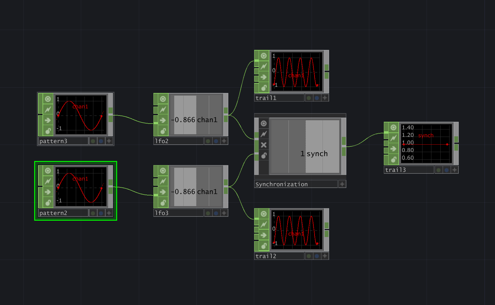

# PyEyesWebTD

*Expressive human movement analysis interactive multimedia installation and performance*

PyEyesWebTD is the TouchDesigner integration of the [PyEyesWeb library](https://github.com/InfoMusCP/PyEyesWeb).  
It brings PyEyesWeb’s expressive movement analysis features into TouchDesigner as modular .tox components,
enabling real-time extraction of quantitative movement features directly within interactive multimedia projects.

> [!TIP]
> PyEyesWebTD has a strong background in movement analysis research.  
> If you are interested in gaining a deeper understanding of the algorithms used,
> please read the [PyEyesWeb Theoretical Framework](https://infomuscp.github.io/PyEyesWeb/user_guide/theoretical_framework/theoretical_framework/).

## Installation

1. Download the latest release from the [Releases page](https://github.com/InfoMusCP/PyEyesWebTD/releases).
2. Unzip the downloaded file.
3. Run `setup.bat` (Windows) or `setup.sh` (Mac) to install the required Python packages.

> [!NOTE]  
> The setup script will check you have Python 3.11 installed to match TouchDesigner version or stop.  
> Please, [install it](https://www.python.org/downloads/release/python-3110/) in advance.

## Usage

PyEyesWebTD consists of multiple .tox components, each representing a specific movement feature of PyEyesWeb.  
To use them in your TouchDesigner project, simply drag and drop the desired .tox files into your network.

    
    
<i>Usage example of the `Synchronization` component to compute the synchronization between two sine waves.</i>

> [!WARNING]  
> Each .tox component expects to find its associated Python script in the `extensions` folder.  
> Please, make sure to keep the folder structure when moving the components to your project.

## Authors & Acknowledgments

PyEyesWebTD is developed by [**InfoMus Lab – Casa Paganini**](http://www.casapaganini.org/index_eng.php), University of Genoa, with the partial support of the **[EU ICT STARTS Resilence Project](https://www.resilence.eu/)**.  

